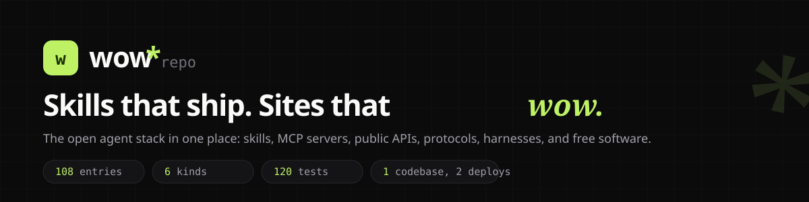
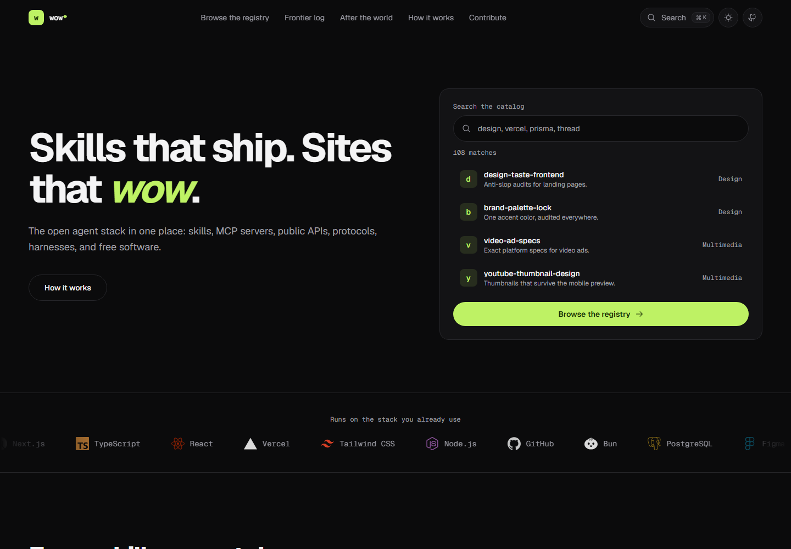
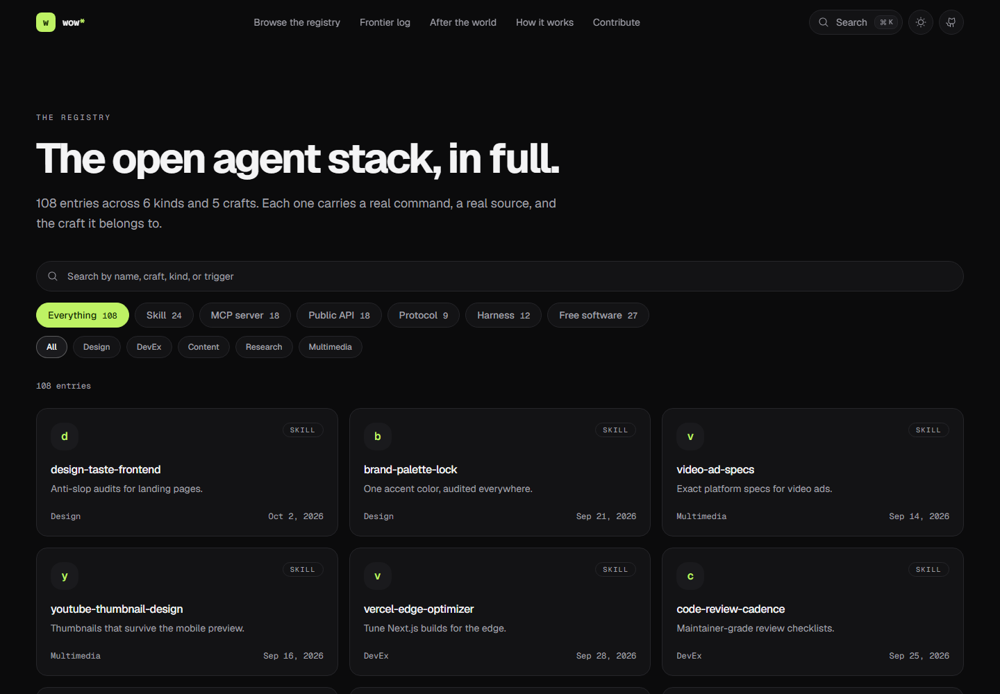
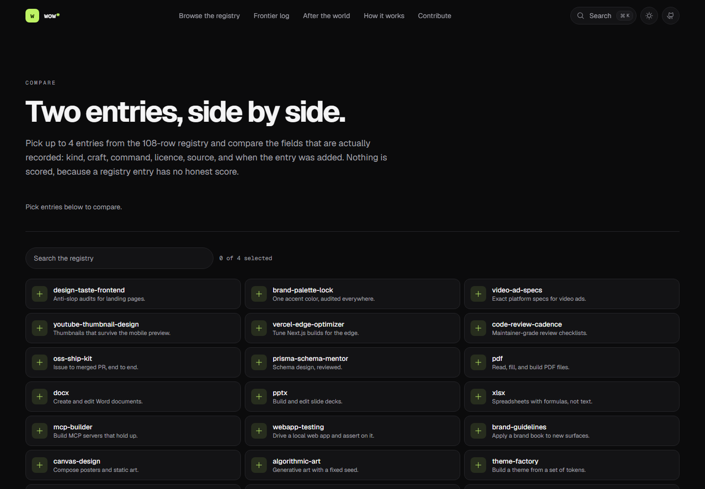
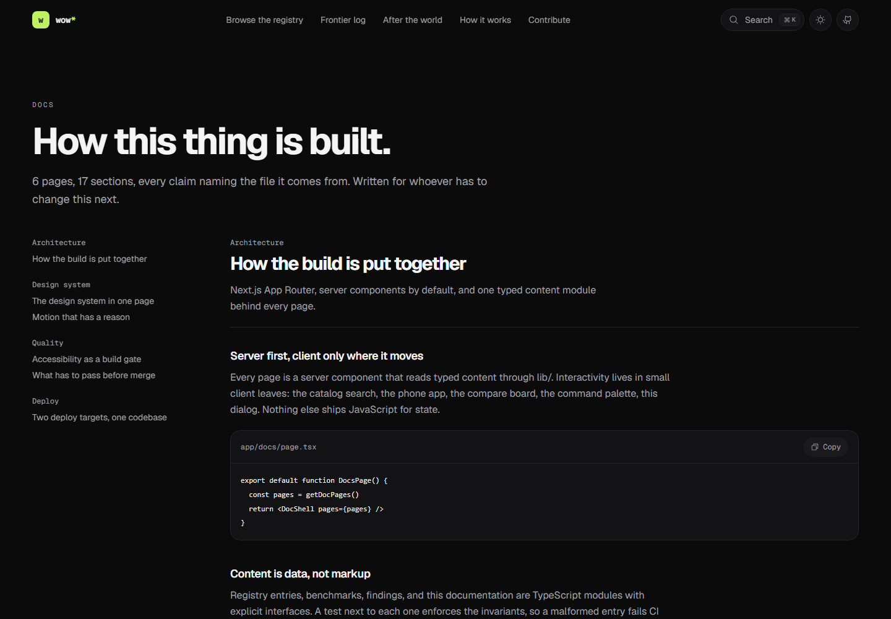
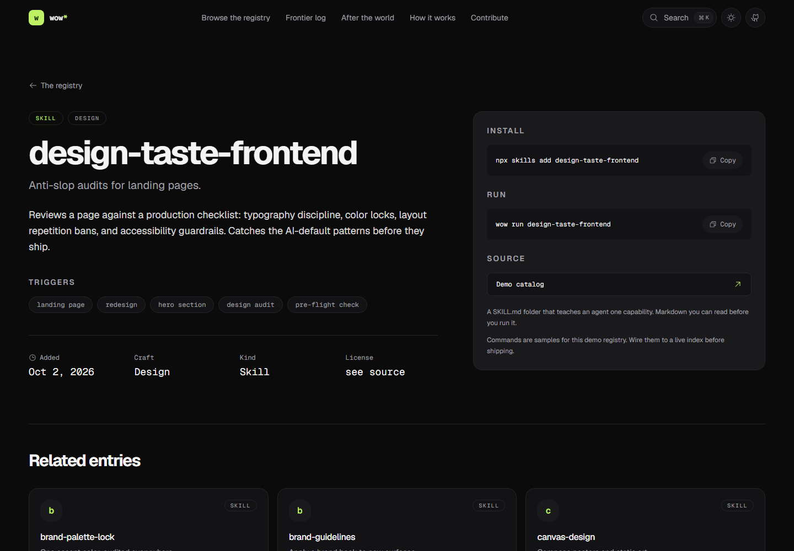
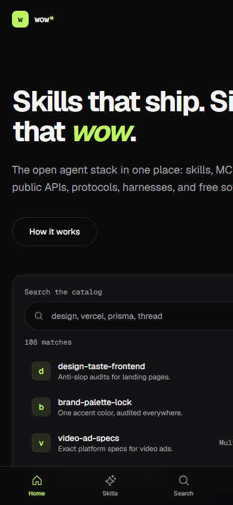
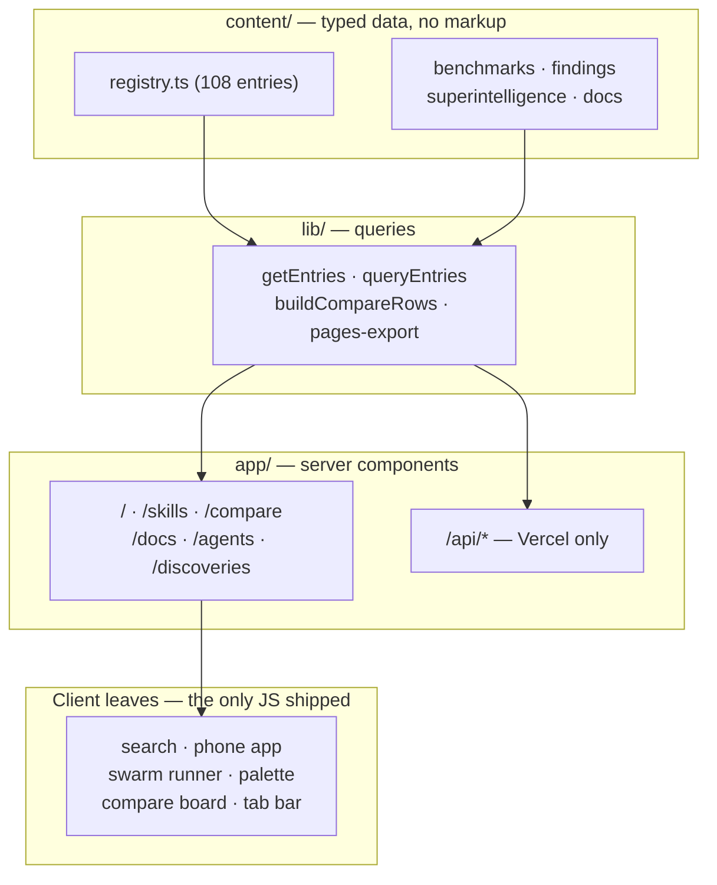
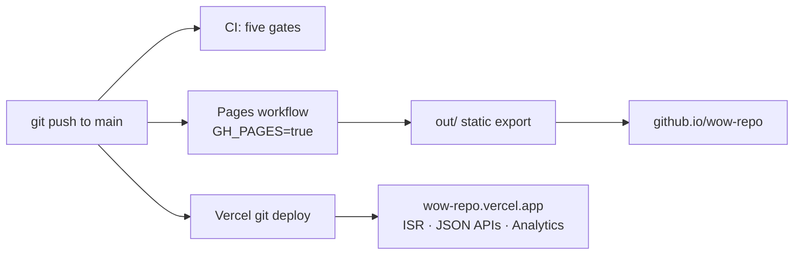
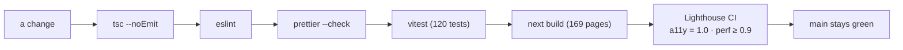

<p align="center">
  
</p>

<p align="center">
  <a href="https://wow-repo.vercel.app">Live site</a> ·
  <a href="https://aniruddhaadak80.github.io/wow-repo/">GitHub Pages mirror</a> ·
  <a href="https://wow-repo.vercel.app/docs">Docs</a> ·
  <a href="https://wow-repo.vercel.app/feed.xml">RSS</a> ·
  <a href="./CONTRIBUTING.md">Contributing</a>
</p>

<p align="center">
  <a href="https://github.com/aniruddhaadak80/wow-repo/actions/workflows/ci.yml"></a>
  <a href="https://github.com/aniruddhaadak80/wow-repo/actions/workflows/pages.yml"></a>
  <a href="https://github.com/aniruddhaadak80/wow-repo/actions/workflows/lighthouse.yml"></a>
  <a href="https://wow-repo.vercel.app"></a>
  <a href="./LICENSE"></a>
</p>

---

<!-- name: wow-repo -->
<!-- description: Production-grade Next.js showcase of the open agent stack. A searchable registry, working demos, and one codebase that deploys to both Vercel and GitHub Pages. -->
<!-- topics: agent-skills, ai-agents, developer-tools, mcp, motion, nextjs, open-source, react, showcase, tailwindcss, typescript, vercel -->

A production-ready Next.js showcase of the open agent stack: **skills, MCP servers, public APIs, protocols, harnesses, and free software**, in one searchable registry. Built to make people say **wow**.

Most "wow" repos are a hero, three cards, and a gradient. This one is a working product: 108 real registry entries, interactive demos that run on the real catalog, an installable PWA, and a build that ships to **two deploy targets** from the same `main` branch.

## Capabilities

Use this repo as a reference implementation, a starter, or a source of copy-pasteable patterns.

| Capability                          | When to reach for it                                                               | Where                                                      |
| ----------------------------------- | ---------------------------------------------------------------------------------- | ---------------------------------------------------------- |
| **Typed content layer**             | You want data in `content/*.ts`, queries in `lib/*.ts`, zero fetches in components | `content/registry.ts`, `lib/registry.ts`                   |
| **Two-target deploy**               | You need one codebase on Vercel (full) and GitHub Pages (static)                   | `next.config.ts`, `lib/pages-export.ts`                    |
| **Client islands, not client apps** | You want interactivity without turning every page into a SPA                       | `components/compare-board.tsx`, `components/phone-app.tsx` |
| **URL as state**                    | Your filter/selection UI should be shareable and reload-safe                       | `components/compare-board.tsx` (`useSyncExternalStore`)    |
| **Design-token discipline**         | One accent, one radius scale, one z-index scale, enforced                          | `app/globals.css`, `lib/constants.ts`                      |
| **Motion with a reason**            | Transform + opacity only, `useReducedMotion` everywhere                            | `components/sections/manifesto.tsx`                        |
| **Dataset integrity tests**         | Your content modules should fail CI when malformed                                 | `content/*.test.ts` (120 tests total)                      |
| **Lighthouse as a gate**            | Accessibility and perf regressions block the merge                                 | `.lighthouserc.json`, `.github/workflows/lighthouse.yml`   |

## Screenshots

<p align="center">
  
</p>

| Registry                                                                                                   | Compare                                                                                       |
| ---------------------------------------------------------------------------------------------------------- | --------------------------------------------------------------------------------------------- |
|  |  |

<p align="center">
  
</p>

<p align="center">
  
  &nbsp;
  
</p>

## Quickstart

```bash
bun install
bun run dev        # http://localhost:3000
bun run check      # typecheck + lint + format + test + build
```

Everything runs with **zero API keys**: the catalog, the demos, the swarm runner, and the benchmarks all read typed local content.

## How it fits together



More diagrams (render flow, content model, compare state machine, deploy pipeline, quality gates, visitor journey, feature map) live in [`docs/diagrams/`](./docs/diagrams) as Mermaid sources.

## Deploy: one codebase, two targets



| Target                 | URL                                                                               | What runs there                                                        |
| ---------------------- | --------------------------------------------------------------------------------- | ---------------------------------------------------------------------- |
| **Vercel** (canonical) | [wow-repo.vercel.app](https://wow-repo.vercel.app)                                | Full app: ISR, `/api/*`, image optimization, Analytics, Speed Insights |
| **GitHub Pages**       | [aniruddhaadak80.github.io/wow-repo](https://aniruddhaadak80.github.io/wow-repo/) | Static export of the same site, built by `pages.yml`                   |

The switch is one environment variable. `GH_PAGES=true` makes `next.config.ts` emit a static export with the repo-name basePath and no image optimizer; Vercel builds leave it unset and keep the server features. The JSON APIs are Vercel-only (Pages has no server to read a query string) and the README says so plainly.

```bash
npx vercel --prod        # deploy the full app
GH_PAGES=true bun run build   # reproduce the Pages build locally (out/)
```

## Quality gates



- **`bun run check`** runs all five gates in one command; CI reruns the same command on every push and PR.
- **Lighthouse CI** audits home, registry, and compare with a desktop preset and _fails the build_ on any accessibility, performance, best-practices, or SEO regression.
- **Dataset tests** assert invariants: unique slugs, valid kinds, in-range scores, internals that agree with their own breakdowns.

## Features

**Design system**

- Tailwind CSS v4 with CSS-variable tokens and a locked single-accent palette (lime on zinc, light + dark modes)
- Geist + Geist Mono via `next/font` (self-hosted, zero layout shift)
- Shape consistency lock: pills for interactive, 16px tiles, 8px chips
- Documented z-index scale in `lib/constants.ts`, one accent hue, one easing curve
- Reduced-motion support everywhere, including scroll-driven motion

**Registry showcase** (`content/registry.ts`, 108 entries across six kinds)

- Skills, MCP servers, APIs, protocols, harnesses, and software, each with a real command and a real link
- `/skills` index with search, kind tabs, and craft filters; `/skills/[slug]` detail pages with triggers, copyable command, and related entries
- `/agents`: a demo org of 24 agents across eight departments, with a replayable orchestration run
- `/discoveries`: a sourced log of scientific findings, plus published curves on machine-research speed
- `/superintelligence`: After the world, 31 sourced entries across five kinds with filters, detail pages, and a JSON API
- Global Cmd/Ctrl+K command palette and `?` keyboard-shortcut dialog

**Working demos, not screenshots**

- Live catalog search in the hero (filters the real data, navigates for real)
- A phone mini-app: search, open, and "install" a skill inside a device frame (also the installable PWA surface)
- The swarm runner: a lead agent fans a task out to real registry entries and merges the reports
- The benchmark scoreboard: sortable runs over typed benchmark content

**Comparison, docs, and feeds**

- `/compare`: up to four entries side by side, selection in the URL so a comparison is a shareable link
- `/docs`: in-repo documentation rendered from `content/docs.ts`, architecture through quality gates
- `/random`: entry roulette, never twice in a row per session
- `/feed.xml`: RSS of the 30 newest entries
- ItemList and BreadcrumbList JSON-LD alongside the WebSite schema

**Platform**

- Static generation with ISR (`revalidate = 3600`); `generateStaticParams` for every registry route
- Edge-cached JSON API (`/api/skills?kind=&craft=&q=`) with `stale-while-revalidate`
- AVIF/WebP images, security headers, `next/og` social cards, `sitemap.xml`, `robots.txt`
- PWA: web manifest, SVG icon, safe-area aware bottom tab bar, install button
- Vercel Analytics and Speed Insights in the root layout; bundle analysis via `bun run analyze`

## Project structure

```
app/                    # App Router: pages, API routes, metadata routes
components/             # Section components and client islands
components/sections/    # One file per page section
content/                # Typed content modules (+ co-located tests)
lib/                    # Queries, constants, compare/docs helpers
docs/diagrams/          # Mermaid sources for the diagrams above
docs/images/            # Banner, logo, and real screenshots
.github/                # CI, Pages, Lighthouse workflows; issue forms; PR template
```

## Contributing

Read [CONTRIBUTING.md](./CONTRIBUTING.md) for the bar for a merge. Five scoped good-first-issues are written and ready to file (see [docs/good-first-issues.md](./docs/good-first-issues.md)); a test asserts the files they name still exist, so a stale issue fails the suite. October rules live in [HACKTOBERFEST.md](./HACKTOBERFEST.md).

## Docs

- [In-repo docs](https://wow-repo.vercel.app/docs) — architecture, design system, motion, accessibility, deploy, quality gates
- [DEPLOY.md](./docs/DEPLOY.md) — env vars and the manual deploy steps
- [design-system.md](./docs/design-system.md) — tokens, shapes, motion rules
- [LAUNCH-POST.md](./docs/LAUNCH-POST.md) — launch post draft

## License

MIT. Registry entries point at real projects; the install commands are samples for the demo, and the UI says so too.
